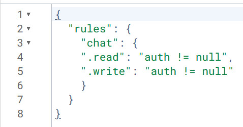

## 	&#9312;制作サイトのタイトル：
### firebase chat App

## &#9313;制作サイトの説明（40文字程度）：
### firebase auth機能を追加したチャットアプリで、googleにログインした状態でなければ、データーベースに書き込みできない、プログラム上もデータベースの権限上もできないようにしました。

## &#9314;工夫した点・こだわった点：
### googleにログインしていない場合、メッセージがnullの場合、アラートが表示されて書き込みできない処理をしています。メッセージのアバター画像、ユーザー名、データベースに書き込むユニークなユーザーID(メアド)はログインしたgoogleから情報を持ってきて処理しています。自分が書き込んだメッセージは右側でメッセージの背景が青色で表示、他の人の書き込みメッセージは背景がグレーで左側表示するように設定しました。
<video controls src="src/assets/React App - Google Chrome 2024-11-21 09-57-23.mp4" title="Title"></video>
## &#9315;難しかった点・次回トライしたこと（または機能）：
### firebase authのgoogle login実装、ユーザーが本人かどうか確認したうえで、表示を動的に変えるところが難しかった。

## &#9316;備考（感想、シェアしたいこと等なんでも）：
### onChildAddedコマンドは発火ポイントが謎だったので使わなかった。
